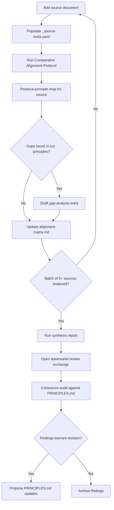

# Constitutional & Formation Document Analysis Framework

## Context

Project 2028's [PRINCIPLES.md](PRINCIPLES.md) contains 17 foundational principles spanning dignity, essential needs, AI governance, accountability, ecological limits, justice, pluralism, and collective power. This effort cross-references those principles against formation documents from nation-states, US states, international bodies, and organizations to answer: **Are our principles broadly shared? What are we missing? Where do others resolve the same tensions differently?**

## Key Research Findings

### Copyright and Hosting Policy

- **US federal documents** (Constitution, Bill of Rights, Declaration of Independence): Public domain under 17 U.S.C. ss 105. Safe to host full text in-repo.
- **US state constitutions**: "Edicts of government" are generally ineligible for copyright. Safe to host or excerpt.
- **Foreign constitutions (original language)**: Most countries treat their constitutions as government edicts exempt from copyright. Safe to host original-language text in nearly all cases.
- **Translations**: This is the complication. Specific translations may be copyrighted derivative works (e.g., HeinOnline translations, Oxford Constitutions of the World). **We should NOT host third-party translations. We should link to them and flag for expert review.**
- **UN/international documents**: UN documents are generally available for reproduction for educational/research use. The UDHR is explicitly distributed for wide dissemination.

**Policy**: Host original-language public domain texts. Link to (do not host) copyrighted translations. Extract and host only analysis excerpts under fair use.

### Existing Databases to Leverage (Not Duplicate)

- **[Constitute Project](https://www.constituteproject.org/)**: 200+ constitutions, searchable by 330+ topics, API available. We should link to this as canonical reference, not rebuild it.
- **[Comparative Constitutions Project](https://comparativeconstitutionsproject.org/)**: Downloadable datasets with constitutional characteristics back to 1789.
- **[50constitutions.org](https://50constitutions.org/)**: All 50 US state constitutions, full text, searchable.
- **[NBER/Maryland State Constitutions Project](http://www.stateconstitutions.umd.edu/)**: Historical and current state constitution texts, downloadable.
- **[Avalon Project (Yale)](http://avalon.law.yale.edu/)**: Historical documents including treaties and founding texts.

### Multilingual Strategy

For non-English documents, each source entry requires:

- The original-language text (hosted or linked)
- A `native_expert_needed` flag with the specific language(s)
- Links to any available official or government-published translations
- A `translation_verification_status` field: `unverified | ai-translated | expert-reviewed`
- AI translation can be used as a working tool but must be flagged as unverified and never treated as authoritative

---

## Directory Structure

New top-level directory: `formation-docs/`

```
formation-docs/
  README.md                              # Purpose, methodology, sourcing policy, phasing
  SOURCING_POLICY.md                     # Copyright rules, hosting vs linking, translation protocol
  SOURCE_REGISTRY.md                     # Master index of all sources with metadata and status
  ALIGNMENT_FRAMEWORK.md                 # How provisions map to Principles 1-17, scoring rubric
  _source-meta-template.yaml             # Template for per-source metadata

  documents/
    nation-states/
      united-states/
        us-constitution.md               # Full text, public domain
        bill-of-rights.md                # Full text, public domain
        declaration-of-independence.md   # Full text, public domain
        _source-meta.yaml
      south-africa/
        constitution-1996.md             # Full text, English is an official language
        _source-meta.yaml
      [other-countries]/
        _source-meta.yaml               # Link-only entries with metadata
    us-states/
      [state-name]/
        [state]-constitution.md          # Full text or preamble excerpt, public domain
        _source-meta.yaml
    international-bodies/
      united-nations/
        un-charter.md                    # Key articles (public dissemination)
        udhr.md                          # Full text (widely distributed)
        _source-meta.yaml
      european-union/
        charter-of-fundamental-rights.md
        _source-meta.yaml
      [others]/
    organizations/
      mondragon/
        cooperative-principles.md
        _source-meta.yaml
      [others]/

  analysis/
    principle-maps/                      # Per-source alignment analysis
      us-constitution-alignment.md
      udhr-alignment.md
      [others].md
    synthesis/                           # Cross-source synthesis reports
      alignment-matrix.md               # The big cross-reference table
      gap-analysis.md                   # Provisions missing from our principles
      uniqueness-report.md              # Our principles that are rare globally
```

### Metadata Schema (`_source-meta.yaml`)

```yaml
document:
  name: ""
  jurisdiction: ""
  jurisdiction_type: "" # nation-state | us-state | international-body | organization
  date_adopted: ""
  date_current_version: ""

language:
  original: "" # ISO 639-1 code
  official_languages: [] # If multiple
  available_translations: [] # Links to official translations
  native_expert_needed: false
  native_expert_language: ""
  translation_verification_status: "unverified"

source:
  canonical_url: ""
  alternate_urls: []
  constitute_project_url: "" # Link into Constitute for national constitutions
  hosted_in_repo: false
  hosting_justification: "" # Why we host vs link
  copyright_status: "" # public-domain | government-edict | cc-license | restricted | unknown
  copyright_notes: ""

analysis:
  status: "not-started" # not-started | in-progress | draft | reviewed | complete
  alignment_map_path: ""
  exchange_path: "" # Link to any exchange discussing this source
```

---

## New Agent Process Protocol

Create `agent/process/comparative-alignment-protocol.md` -- a new reusable protocol for mapping external formation documents against PRINCIPLES.md.

**Protocol structure:**

- **Trigger**: When a new formation document is added to `formation-docs/documents/`
- **Scope**: Map each provision of the source document to Principles 1-17
- **Scoring rubric**:
  - **Explicit alignment** -- the source directly addresses the same value
  - **Implicit alignment** -- the principle is implied or partially addressed
  - **Absent** -- the source does not address this value
  - **Contrary** -- the source takes an opposing position
  - **Different resolution** -- the source addresses the same tension but resolves it differently
- **Gap identification**: Flag source provisions that do not map to any of our 17 principles
- **Output**: A per-source alignment map (markdown) in `formation-docs/analysis/principle-maps/`
- **Epistemic status**: Every mapping must note confidence level and whether it reflects the document's text, judicial interpretation, or cultural practice
- **Integration**: Feed findings into adversarial review (existing protocol) for challenge; feed confirmed gaps into PRINCIPLES.md revision proposals

---

## Analysis Pipeline

The pipeline uses existing agent protocols plus the new comparative alignment protocol:



---

## Phasing

### Phase 1: Foundation (infrastructure + proof of concept)

- Create directory structure and all framework documents
- Write sourcing policy, metadata schema, alignment framework
- Write comparative alignment protocol
- Add US founding documents: Constitution, Bill of Rights, Declaration of Independence
- Run first alignment analysis (US Constitution vs. PRINCIPLES.md) as proof of concept
- Register this effort in ROADMAP.md and open an exchange

### Phase 2: English-language expansion

- Add key national constitutions available in English: South Africa (1996), Canada (Charter of Rights and Freedoms), India (Preamble + Fundamental Rights chapters)
- Add UDHR and UN Charter
- Add 4-6 representative US state constitutions (diverse selection: e.g., California, Massachusetts, Montana, Texas)
- Run alignment analyses, begin building the alignment matrix
- Open adversarial review exchange on initial findings

### Phase 3: Multilingual and international expansion

- Add non-English constitutions with metadata flags: Germany (Grundgesetz), France (Declaration of the Rights of Man), Japan (1947 Constitution), Brazil, etc.
- Add EU Charter of Fundamental Rights, African Union Constitutive Act
- Establish translation verification workflow
- Begin recruiting native language experts via contributor calls
- AI-assisted working translations (flagged as unverified)

### Phase 4: Organizations, synthesis, and feedback loop

- Add organizational founding documents: Mondragon Cooperative Principles, International Cooperative Alliance Statement on Identity, B Corp Declaration of Interdependence
- Produce full alignment matrix across all sources
- Gap analysis: what are other documents encoding that we are not?
- Uniqueness report: which of our 17 principles are rare or novel?
- Adversarial review of synthesis findings
- Feed confirmed findings into PRINCIPLES.md revision proposals or new principles

---

## Priority Source Documents (Phase 1-2 shortlist)

**Nation-states (English-available, high-signal):**

- United States -- Constitution + Bill of Rights + Declaration of Independence
- South Africa -- Constitution of 1996 (widely regarded as one of the most comprehensive rights-based constitutions)
- Canada -- Canadian Charter of Rights and Freedoms (1982)
- India -- Preamble + Part III (Fundamental Rights) + Part IV (Directive Principles)

**International bodies:**

- Universal Declaration of Human Rights (1948)
- United Nations Charter (1945)

**US states (diverse selection):**

- California -- long, detailed, progressive amendments
- Massachusetts -- oldest functioning constitution (1780)
- Montana -- strong privacy and environmental rights
- Texas -- different philosophical tradition, strong property/liberty emphasis

**Why these first:** They represent a range of philosophical traditions, are available in English, are clearly in the public domain, and are likely to produce interesting alignment and divergence patterns against our 17 principles.

---

## Relationship to Existing Work

- **Existing protocols**: Adversarial review, coherence audit, and historical parallel test all apply to this work. The comparative alignment protocol is additive, not duplicative.
- **Exchange index**: The kickoff exchange for this effort gets registered in `_EXCHANGE_INDEX.md` as a new numbered entry.
- **ROADMAP.md**: This becomes a new track (alongside practitioner critique and validation case design).
- **Constitute Project**: We link to it as a reference resource; we do not rebuild its database. Our value-add is the specific cross-reference against our 17 principles.
