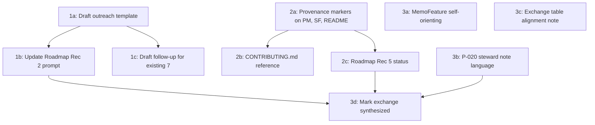

# Exchange #17 Implementation Plan

This plan covers every actionable finding from the five-round exchange. Items are grouped into three tiers by strategic importance, following Round 5's prioritized "what the project should do next" list.

---

## Tier 1: Outreach redesign (highest priority per Round 5)

The exchange's clearest conclusion is that **effort calibration + trust framing** in the outreach message itself matters more than any website label. These changes directly affect the next wave of practitioner responses.

### 1a. Draft a revised outreach template

Create a new file `docs/PRACTITIONER_OUTREACH_TEMPLATE.md` containing:

- A short, plainly human-voiced intro paragraph (Round 3, section 5 -- the "experiment I'm working on" voice)
- Explicit AI-collaboration disclosure using provenance-standard vocabulary (Round 1, 3b)
- A bounded, lower-effort ask -- two specific questions, not "read this memo" (Round 3, section 2 / Round 5 response to challenge 1)
- The two-pass structure: Pass 1 asks about legibility/credibility, Pass 2 asks the existing (a)-(d) substance questions (Round 1, 3a)
- Permission to critique the medium, not just the message

### 1b. Update Roadmap Recommendation 2 prompt structure

In [ROADMAP.md](ROADMAP.md), revise the structured prompt section (current lines 46-51) to:

- Formalize the two-pass structure
- Reference the outreach template
- Add "entry-trust clearance rate" as a named tracking metric (Round 5 response to challenge 4)

### 1c. Draft a follow-up message for existing 7 contacts

Add a short follow-up template to the outreach template file, acknowledging the original link dropped them into the middle, providing orientation context, and offering the bounded ask (Round 1, 3c / Round 3, section 7 item 1).

---

## Tier 2: Close coherence audit gaps (Round 2 checklist)

These are required by the project's own Content Provenance Standard. Five items, all in project-2028.

### 2a. Add provenance markers to remaining core documents

Three files need `provenance: "[collaborative]"` in frontmatter plus a visible callout after the title (same pattern used in [PRINCIPLES.md](PRINCIPLES.md)):

- [PROBLEM_MAP.md](PROBLEM_MAP.md) -- already has process-description prose at line 15; add the standard label and link to `docs/CONTENT_PROVENANCE.md`
- [SYSTEMS_FRAMEWORK.md](SYSTEMS_FRAMEWORK.md) -- already has process-description prose at line 12; same treatment
- [README.md](README.md) -- add provenance disclosure near the top

### 2b. Add provenance-standard reference to CONTRIBUTING.md

At [CONTRIBUTING.md](CONTRIBUTING.md) line 191, after the existing sentence about provenance, add one sentence: "For the project's canonical provenance labeling policy, see [Content Provenance Standard](docs/CONTENT_PROVENANCE.md)."

### 2c. Update Roadmap Recommendation 5 status

Change [ROADMAP.md](ROADMAP.md) Recommendation 5 from "Not yet started" to "Partially started" with a note that the Content Provenance Standard addresses the transparency-commitment dimension while evidence-type and interpretation commitments remain open.

---

## Tier 3: Website and document adjustments

### 3a. Make MemoFeature self-orienting

In [website/src/components/MemoFeature.tsx](website/src/components/MemoFeature.tsx), add one sentence of project identity at the top of the left-column content (before the "Start With One Concrete Example" eyebrow), so the `#memo` anchor section stands alone when the Hero is not visible. Something like: "Civic Blueprint is an open project analyzing why critical systems fail and how they might be redesigned."

This is the single highest-value website change identified in the exchange (Round 1, 2a / Round 3, section 3).

### 3b. Update P-020 steward note language

In [proposals/PROPOSAL_CATALOG.md](proposals/PROPOSAL_CATALOG.md), revise the P-020 steward note to use "illustrates the class of problem" rather than language that implies validation (Round 5, response to challenge 5). Current text at line 327 says "How might we incorporate this policy into our project here as well?" -- that is fine to keep, but any language added about the practitioner experience should use the downgraded framing.

### 3c. Align exchange opening table with canonical standard (minor)

In [first-practitioner-critique-ai-provenance-exchange.md](agent/exchanges/first-practitioner-critique-ai-provenance-exchange.md), add a note below the opening provenance-spectrum table that the canonical reference is `docs/CONTENT_PROVENANCE.md` and the exchange table was the working draft (Coherence audit item #6).

### 3d. Mark Exchange #17 as synthesized

Update the status block at the top of the exchange file and the corresponding entry in [\_EXCHANGE_INDEX.md](agent/exchanges/_EXCHANGE_INDEX.md) to reflect "Synthesized" status with a summary of what the five rounds produced.

---

## Tier 4: Strategic preparation (steward decisions, not agent edits)

These items require steward judgment and cannot be implemented autonomously, but should be tracked:

- **Review Exchanges #7 and #12** to identify memo claims most likely to draw practitioner pushback if the trust barrier is cleared. Decide whether pre-emptive revision is warranted. (Round 5, response to challenge 6)
- **Accelerate Recommendation 4** (fast-feedback validation case). The exchange concludes this is the actual trust-builder, not provenance labeling. (Round 5, priority item 5)
- **Monitor the double-`docs` URL pattern** (`/docs/docs/content-provenance`) for user confusion. Consider whether `docs/` as a subdirectory in project-2028 should be renamed long-term. (Coherence audit item #7)

---

## Sequencing

## Files to create

- `docs/PRACTITIONER_OUTREACH_TEMPLATE.md`

## Files to modify (project-2028)

- `ROADMAP.md` (Rec 2 prompt structure, Rec 5 status)
- `PROBLEM_MAP.md` (provenance frontmatter + callout)
- `SYSTEMS_FRAMEWORK.md` (provenance frontmatter + callout)
- `README.md` (provenance disclosure)
- `CONTRIBUTING.md` (one-sentence reference to provenance standard)
- `proposals/PROPOSAL_CATALOG.md` (P-020 steward note language)
- `agent/exchanges/first-practitioner-critique-ai-provenance-exchange.md` (table note, status block)
- `agent/exchanges/_EXCHANGE_INDEX.md` (entry #17 status + produced)

## Files to modify (civicblueprint.org)

- `website/src/components/MemoFeature.tsx` (self-orienting sentence)
