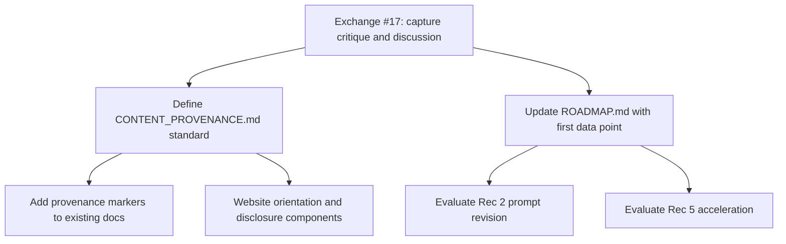

# First Practitioner Critique and AI Content Provenance Exchange

## Context

The project received its first response to Recommendation 2 (structured practitioner critique). A federal HHS practitioner in Washington D.C. flagged two issues: (1) the memo "feels AI generated" and triggered an immediate credibility filter, and (2) linking directly to `#memo` without project orientation caused confusion. The steward also noted the parallel to proposal P-020 (AI Content Provenance Mandate) and asked how the project should dog-food its own content provenance policy.

## Part 1: Exchange #17

Create `agent/exchanges/first-practitioner-critique-ai-provenance-exchange.md` as Exchange #17. This exchange captures:

- **The critique itself** (redacted): AI-generated texture as a credibility barrier, entry-point confusion
- **The steward's reflection**: the project is experiencing the same information-integrity problem it diagnoses (Problem Map section 3, Principle 14)
- **The AI content demarcation question**: how to define provenance on a spectrum for human-AI collaborative work
- **Implications for Recommendation 2**: whether the structured prompt needs revision, whether other contacted practitioners need a different entry point
- **Implications for the website**: orientation layer, provenance disclosure
- **Connection to P-020**: dog-fooding the project's own policy proposal

Dependencies:

- [Exchange #7](agent/exchanges/proof-of-usefulness-feedback-timescale-review.md) (Recommendation 2 originated here)
- [Exchange #6](agent/exchanges/proof-of-usefulness-housing-vs-ai.md) (memo decision)
- [Exchange #8](agent/exchanges/voice-synthesis-accessibility-engagement-exchange.md) (communication design and engagement)
- [Roadmap](ROADMAP.md) (Recommendation 2 status)
- [Principles](PRINCIPLES.md) (section 14 - truth and evidence; section 4 - accountable power)
- [Problem Map](PROBLEM_MAP.md) (section 3 - information ecosystems)
- [Proposal Catalog](proposals/PROPOSAL_CATALOG.md) (P-020 steward note)
- Cross-repo: civicblueprint.org website components (MemoFeature, Hero, docs layout)

Register in [\_EXCHANGE_INDEX.md](agent/exchanges/_EXCHANGE_INDEX.md) as entry #17, update the dependency graph.

### Exchange content structure

**Round 1 (opening):**

- Full redacted transcript of the practitioner exchange
- Steward's analysis of what this signals
- The four questions this exchange needs to answer:
  1. How should the project define and label AI-involvement across its content spectrum?
  2. What changes to the website entry point would address orientation confusion?
  3. Should the Recommendation 2 structured prompt be revised based on this feedback?
  4. Is the project's own experience a useful first data point for the P-020 argument?

**Proposed content provenance spectrum** (for discussion in the exchange):

| Level                                    | Label                             | Description                                                                    | Project examples                                       |
| ---------------------------------------- | --------------------------------- | ------------------------------------------------------------------------------ | ------------------------------------------------------ |
| Human-authored                           | `[human]`                         | Written entirely by the steward                                                | Outreach messages, steward notes, personal reflections |
| Human-directed, AI-drafted, human-edited | `[collaborative]`                 | Steward defined scope/constraints; AI drafted; steward revised and approved    | PRINCIPLES.md, SYSTEMS_FRAMEWORK.md, Memo 01           |
| AI-generated, human-curated              | `[ai-generated, steward-curated]` | AI produced content within structured protocols; steward reviewed and selected | Proposal catalog entries, exchange outputs             |
| AI-generated, unreviewed                 | `[ai-generated]`                  | Raw agent output not yet through steward review                                | Internal exchange rounds pre-synthesis                 |

---

## Part 2: Implementation recommendations

### 2a. Define a project content provenance standard

- Create a new file `docs/CONTENT_PROVENANCE.md` in project-2028 that defines the provenance spectrum above
- Establish the standard labels and when each applies
- Reference P-020 and explain that the project is dog-fooding its own policy proposal
- This document becomes a project-level policy that guides all future content

### 2b. Add provenance markers to existing public-facing content

- Add a provenance disclosure to [PRINCIPLES.md](PRINCIPLES.md) (already has a brief note at line 8; enhance it with the standard label)
- Add a provenance disclosure to the memo source file (`memos/proof-of-usefulness-memo-01.md`)
- The [PROPOSAL_CATALOG.md](proposals/PROPOSAL_CATALOG.md) header at line 9 already discloses "No steward input during generation" -- enhance with the standard label
- Consider whether exchange files need provenance markers (they already describe their process in status blocks)

### 2c. Website orientation layer (civicblueprint.org changes)

- Add a short, clearly human-authored orientation paragraph to [Hero.tsx](website/src/components/Hero.tsx) or create a new component that appears before the memo when someone lands on `#memo`
- Add a visible provenance/authorship disclosure component to the docs layout ([docs/[...slug]/page.tsx](website/src/app/docs/[...slug]/page.tsx)) -- could read from frontmatter metadata
- Consider adding a "How this was made" link in [MemoFeature.tsx](website/src/components/MemoFeature.tsx) that links to the provenance doc
- Address the direct-link problem: when someone arrives at `/#memo` from an external link, they should see enough context to understand what the project is before reading the memo

### 2d. Update Roadmap with first practitioner feedback

- Update Recommendation 2 in [ROADMAP.md](ROADMAP.md) to log this as the first data point
- Note the two findings: AI-texture credibility barrier, entry-point orientation gap
- Consider whether the structured prompt (items a-d at lines 46-49) needs a preamble about how the content was produced
- Consider whether remaining outreach should include orientation context rather than linking directly to `#memo`

### 2e. Evaluate whether Recommendation 5 (transparent evidence integration) should be accelerated

- The provenance standard partially addresses Recommendation 5's goal of publishing evidence-handling commitments in advance
- Consider whether this work satisfies enough of Rec 5 to mark it as started

---

## Sequencing

## Files to create

- `agent/exchanges/first-practitioner-critique-ai-provenance-exchange.md` (new Exchange #17)

## Files to modify

- `agent/exchanges/_EXCHANGE_INDEX.md` (register Exchange #17, update dependency graph)
- `ROADMAP.md` (log first practitioner data point under Recommendation 2)

## Files to create (implementation phase, after exchange discussion)

- `docs/CONTENT_PROVENANCE.md` (provenance standard definition)

## Files to modify (implementation phase, after exchange discussion)

- `PRINCIPLES.md` (enhanced provenance disclosure)
- `memos/proof-of-usefulness-memo-01.md` (provenance disclosure)
- `proposals/PROPOSAL_CATALOG.md` (enhanced provenance label in header)
- civicblueprint.org website components (orientation and disclosure -- specific files TBD after exchange discussion settles the design)
